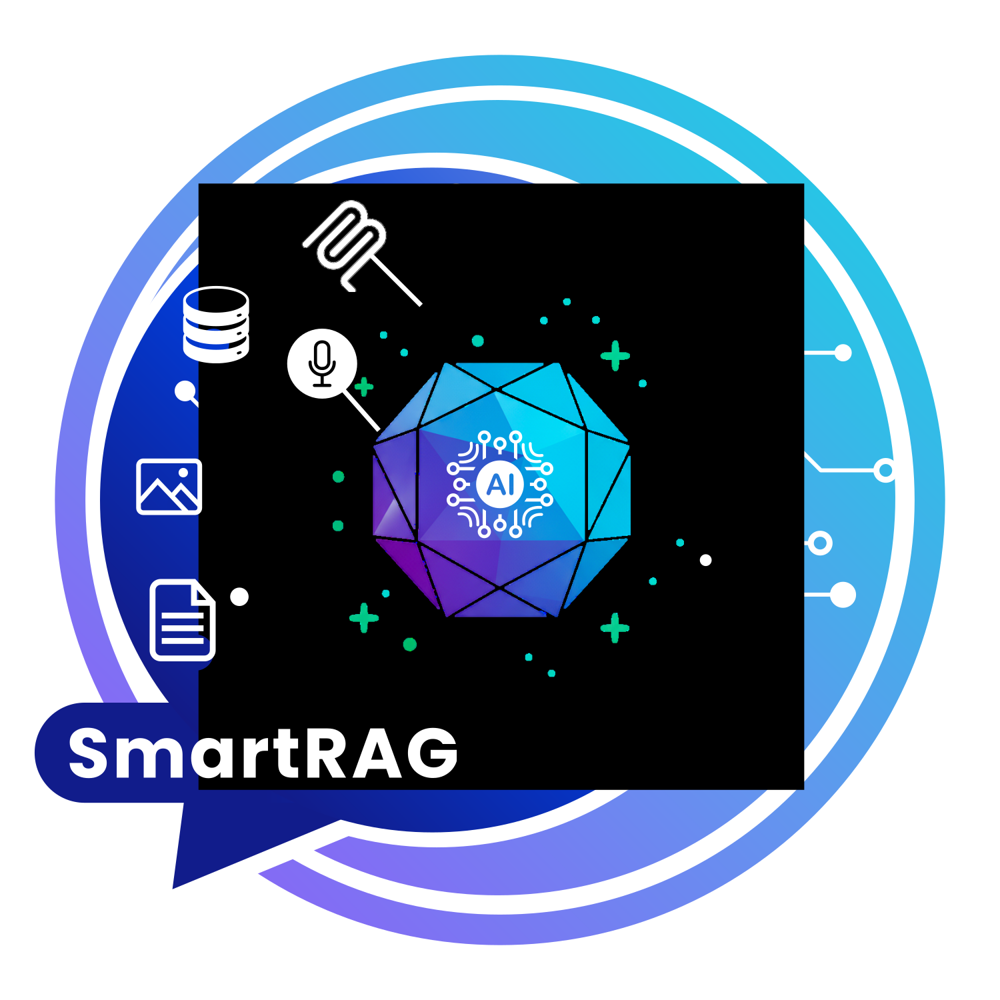

<p align="center">
  
</p>

<p align="center">
  <b>Multi-Database RAG Library for .NET</b><br>
  Ask questions about your data in natural language.
</p>

<p align="center">
  <a href="#-quick-start">Quick Start</a> •
  <a href="#-why-smartrag">Why SmartRAG</a> •
  <a href="#-what-you-can-build">Examples</a> •
  <a href="#-smartrag-vs-other-net-rag-libraries">Comparison</a> •
  <a href="https://byerlikaya.github.io/SmartRAG">Documentation</a>
</p>

<p align="center">
  <a href="https://www.nuget.org/packages/SmartRAG"></a>
  <a href="https://www.nuget.org/packages/SmartRAG"></a>
  <a href="https://github.com/byerlikaya/SmartRAG"></a>
  <a href="LICENSE"></a>
</p>

---

# 🚀 SmartRAG - Ask Questions About Your Data

**Turn your documents, databases, images and audio into a conversational AI system.**

```csharp
// 1. Connect your databases
await connector.ConnectAsync(sqlServer: "Server=localhost;Database=Sales;", 
                              mysql: "Server=localhost;Database=Customers;",
                              postgresql: "Host=localhost;Database=Analytics;");

// 2. Upload documents, PDFs, Excel files, images
await documents.UploadAsync(files);

// 3. Ask in natural language
var answer = await intelligence.QueryIntelligenceAsync(
    "Show me customers with over $100K revenue across all databases"
);
// → AI automatically queries SQL Server, MySQL, PostgreSQL and combines results
```

---

## 🎯 Why SmartRAG?

SmartRAG lets you query multiple databases with natural language while combining document intelligence.

✅ **Multi-Database RAG** - Query SQL Server, MySQL, PostgreSQL, SQLite **together** in one natural language request  
✅ **Multi-Modal Intelligence** - Combine PDFs, Excel, Images (OCR), Audio (Speech-to-Text), and Databases in one answer  
✅ **On-Premise Ready** - 100% local operation with Ollama, LM Studio, Whisper.net → GDPR/KVKK/HIPAA compliant  
✅ **Production Ready** - Enterprise-grade error handling, comprehensive testing, production-ready  
✅ **Conversation History** - Built-in automatic context management across multiple questions  
✅ **.NET Standard 2.1** - Works with .NET Core 3.0+, .NET 5/6/7/8/9

---

## 📊 What You Can Build

### **🏦 Banking - Complete Financial Intelligence**
```csharp
"Show me John's complete financial profile for credit limit increase"
```
→ AI combines:
- **SQL Server**: 36 months transaction history, bill payments
- **MySQL**: Credit card usage patterns
- **PostgreSQL**: Credit score, existing loans
- **SQLite**: Branch visit history
- **OCR**: Scanned income documents
- **PDF**: Account statements

**Result:** 360° customer intelligence in seconds, not hours.

---

### **🏥 Healthcare - Unified Patient Records**
```csharp
"Show Emily's complete medical history for the past year"
```
→ AI combines:
- **PostgreSQL**: Patient records, admissions
- **Excel**: Lab results from 3 different labs
- **OCR**: Scanned prescriptions
- **Audio**: Doctor's voice notes (Whisper.net transcription)

**Result:** Complete patient timeline from 4 disconnected systems.

---

### **📦 Inventory - Predictive Analytics**
```csharp
"Which products will run out of stock in the next 2 weeks?"
```
→ AI combines:
- **SQLite**: Product catalog (10,000 SKUs)
- **SQL Server**: Sales data (2M transactions/month)
- **MySQL**: Real-time stock levels
- **PostgreSQL**: Supplier lead times

**Result:** Cross-database predictive analytics preventing stockouts.

[See 10 detailed real-world examples below ↓](#-real-world-examples---what-you-can-build-with-smartrag)

---

## 🆚 SmartRAG vs Other .NET RAG Libraries

| Feature | SmartRAG | Semantic Kernel | Kernel Memory |
|---------|----------|-----------------|---------------|
| **Multi-Database RAG** | ✅ | ❌ | ❌ |
| **On-Premise (Ollama)** | ✅ 100% | ⚠️ Limited | ⚠️ Limited |
| **OCR + Audio + DB** | ✅ All-in-one | ❌ Separate | ❌ Separate |
| **Conversation History** | ✅ Built-in | ⚠️ Manual | ✅ Built-in |
| **Multi-Modal** | ✅ 7+ formats | ⚠️ Basic | ✅ Multi-modal |
| **.NET Standard 2.1** | ✅ | ❌ (.NET 6+) | ❌ (.NET 6+) |
| **GDPR/HIPAA Ready** | ✅ Local AI | ⚠️ Cloud-first | ⚠️ Cloud-first |
| **Focus** | Multi-DB + RAG | AI Orchestration | RAG-specific |
| **Maintainer** | Independent | Microsoft | Microsoft |

**Key Differences:**
- **Semantic Kernel**: General AI orchestration framework, not RAG-specific
- **Kernel Memory**: RAG-focused but no multi-database support
- **SmartRAG**: Specialized in multi-database RAG capabilities

**Bottom line:** If you need to query multiple databases with AI or require on-premise deployment, SmartRAG is built for this.

---

## 📦 Quick Start

### Installation
```bash
dotnet add package SmartRAG
```

### 5-Minute Setup
```csharp
// Program.cs
builder.Services.UseSmartRAG(builder.Configuration,
    aiProvider: AIProvider.OpenAI,
    storageProvider: StorageProvider.InMemory
);

// Controller or Service
public class MyService
{
    private readonly IDocumentSearchService _intelligence;
    
    public MyService(IDocumentSearchService intelligence)
    {
        _intelligence = intelligence;
    }
    
    public async Task<string> AskQuestion(string question)
    {
        var result = await _intelligence.QueryIntelligenceAsync(question, maxResults: 5);
        return result.Answer;
    }
}
```

### Configuration (appsettings.json)
```json
{
  "AI": {
    "OpenAI": {
      "ApiKey": "sk-your-key",
      "Model": "gpt-4",
      "EmbeddingModel": "text-embedding-ada-002"
    }
  }
}
```

**That's it!** You now have a production-ready RAG system. 🎉

[Full documentation →](https://byerlikaya.github.io/SmartRAG)

---

## 🔒 On-Premise & Local AI Support

**CRITICAL FOR ENTERPRISE**: SmartRAG is designed for **complete on-premise deployment** with **full data privacy**. You can run everything locally without sending data to cloud services.

### ✅ **100% Local Operation** (No Cloud Required)
- **🏠 Local AI Models**: Full support for Ollama, LM Studio, and any OpenAI-compatible local API
- **📄 Document Processing**: PDF, Word, Excel parsing - **completely local**
- **🖼️ OCR Processing**: Tesseract 5.2.0 - **completely local**, no data sent to cloud
- **🎤 Audio Transcription**: Whisper.net - **completely local**, supports 99+ languages
- **🗄️ Database Integration**: SQLite, SQL Server, MySQL, PostgreSQL - **all local connections**
- **💾 Storage Options**: In-Memory, SQLite, FileSystem, Redis - **all local**
- **🧠 Embeddings & AI**: Use your own local models via CustomProvider
- **🔐 Complete Privacy**: All your data stays on your infrastructure

### ⚠️ **Important Notes**

#### **Audio Files - Local & Cloud Options**
**SmartRAG supports both local and cloud audio transcription for maximum flexibility:**

**🏠 Local Transcription (Whisper.net) - DEFAULT & RECOMMENDED:**
- ✅ **100% Privacy**: All audio processing happens locally, no data sent to cloud
- ✅ **Multi-Language**: 99+ languages including Turkish, English, German, Russian, Chinese, Arabic
- ✅ **Zero Setup**: Whisper model AND FFmpeg binaries auto-download on first use
- ✅ **Cost**: Completely free, unlimited usage
- ✅ **GDPR/KVKK/HIPAA**: Fully compliant for on-premise deployments
- ✅ **Hardware Acceleration**: CPU, CUDA (NVIDIA GPU), CoreML (Apple), OpenVino (Intel)
- 🎯 **Production-Ready**: Default large-v3 model for enterprise-grade accuracy
- ⚙️ **Self-Contained**: No manual installation required, everything downloads automatically

**Model Comparison & Selection:**
| Model | Size | Speed | Accuracy | Language Detection | Use Case |
|-------|------|-------|----------|-------------------|----------|
| `ggml-tiny.bin` | 75 MB | ⚡⚡⚡⚡⚡ | ⭐⭐ | ❌ Poor | Quick testing only |
| `ggml-base.bin` | 142 MB | ⚡⚡⚡⚡ | ⭐⭐⭐ | ⚠️ Basic | Simple demos |
| `ggml-medium.bin` | 1.5 GB | ⚡⚡⚡ | ⭐⭐⭐⭐ | ✅ Good | Good balance |
| **`ggml-large-v3.bin`** | **2.9 GB** | **⚡⚡** | **⭐⭐⭐⭐⭐** | **✅ Excellent** | **🎯 DEFAULT - Production** |

**Why Large-v3 as Default?**
- 🎯 **Critical Accuracy**: RAG systems require perfect transcription for reliable results
- 🌍 **Superior Language Detection**: Accurately distinguishes Turkish/English/German/etc.
- 🔇 **Minimal Hallucination**: Advanced filtering prevents duplicate/noise segments
- 💾 **One-Time Download**: 2.9 GB downloads once, cached forever (~5-10 min first run)
- 🏢 **Enterprise-Ready**: Suitable for production systems with critical accuracy needs
- 💰 **Cost-Effective**: No per-request pricing, unlimited local usage after download

**☁️ Cloud Transcription (Google Cloud Speech-to-Text) - OPTIONAL:**
- 📤 Audio data sent to Google Cloud for processing
- 💰 Requires Google Cloud API key and billing
- ⚡ Real-time transcription
- 🔒 If data privacy is critical, use Whisper.net instead

#### **OCR (Image to Text) Limitation**
**Tesseract OCR library cannot fully support handwritten text (success rate is very low)**:
- ✅ **Works perfectly**: Printed documents, scanned printed documents, digital screenshots with typed text
- ⚠️ **Limited support**: Handwritten notes, handwritten forms, cursive writing (very low accuracy, not recommended)
- 💡 **Best results**: High-quality scans of printed documents, clear digital images with printed text
- 🌍 **Supported languages**: 100+ languages - [View all supported languages](https://github.com/tesseract-ocr/tessdata)
- 📝 **Recommendation**: Use printed text documents for optimal OCR results

### 🏢 **Suitable for Enterprise On-Premise Systems**
- ✅ **GDPR Compliant**: Keep all data within your infrastructure
- ✅ **KVKK Compliant**: Turkish data protection law compliance
- ✅ **Air-Gapped Systems**: Works 100% without internet (Whisper.net for audio)
- ✅ **Financial Institutions**: Bank-grade security with local deployment
- ✅ **Healthcare**: HIPAA-compliant deployments possible
- ✅ **Government**: Classified data handling with local models

### 🛠️ **Local AI Setup Examples**

#### Ollama (Local Models)
```json
{
  "AI": {
    "Custom": {
      "ApiKey": "not-needed",
      "Endpoint": "http://localhost:11434/v1/chat/completions",
      "Model": "llama2",
      "EmbeddingModel": "nomic-embed-text"
    }
  }
}
```

#### LM Studio (Local Models)
```json
{
  "AI": {
    "Custom": {
      "ApiKey": "not-needed",
      "Endpoint": "http://localhost:1234/v1/chat/completions",
      "Model": "local-model",
      "EmbeddingModel": "local-embedding"
    }
  }
}
```

#### Whisper.net (Local Audio Transcription)
```json
{
  "SmartRAG": {
    "AudioProvider": "Whisper",
    "WhisperConfig": {
      "ModelPath": "models/ggml-large-v3.bin",  // Production default
      "DefaultLanguage": "auto",  // Auto-detect language
      "MinConfidenceThreshold": 0.3,  // Lower threshold + smart filtering
      "PromptHint": "Natural conversation",  // Context hint for accuracy
      "MaxThreads": 0  // Use all CPU cores (0 = auto-detect)
    }
  }
}
```

**Model Selection Table:**
| Model | Size | Speed | Best For | Command |
|-------|------|-------|----------|---------|
| `ggml-tiny.bin` | 75 MB | Very Fast | Testing only | Quick prototypes |
| `ggml-base.bin` | 142 MB | Fast | Demos | Simple transcription |
| `ggml-medium.bin` | 1.5 GB | Balanced | Good quality | Medium accuracy needs |
| **`ggml-large-v3.bin`** | **2.9 GB** | **Slower** | **🎯 Production** | **Enterprise deployments** |

**Default Model: Large-v3** ✅
- **Why?** RAG accuracy depends on perfect transcription
- **Download Once:** 2.9 GB cached forever, no recurring costs
- **Multi-Language:** Best language detection (Turkish/English/German distinction)
- **Low Hallucination:** Advanced duplicate/noise filtering built-in
- **Cost Analysis:** Free forever vs. $0.006/min Google Cloud = ROI after 500 hours

**Automatic Setup (Zero Configuration):**
- ✅ Whisper model: Auto-downloads from Hugging Face (~2.9 GB, 5-10 min first run)
- ✅ FFmpeg binaries: Auto-downloads and configures (~100 MB)
- ✅ No manual installation needed
- ✅ One-time download, cached permanently
- ✅ Subsequent runs: Instant startup (model already on disk)

**Optional: Pre-install FFmpeg** (for faster first run):
- **Windows**: `choco install ffmpeg`
- **macOS**: `brew install ffmpeg`
- **Linux**: `sudo apt install ffmpeg`

If FFmpeg is already installed, SmartRAG will detect and use it automatically.

### 🎯 **Enterprise Use Cases**
- **🏦 Banking & Finance**: Process sensitive financial documents locally
- **🏥 Healthcare**: Handle patient records without cloud exposure
- **⚖️ Legal**: Manage confidential legal documents on-premise
- **🏛️ Government**: Classified document analysis with local AI
- **🏭 Manufacturing**: Keep industrial secrets within your network
- **💼 Consulting**: Client data never leaves your infrastructure

**Your data, your infrastructure, your control.** 🔐

---

### 💡 **About These Examples**

The examples below demonstrate SmartRAG's technical capabilities in real-world scenarios:

- ✅ **All features are production-ready** - Multi-database queries, OCR, audio processing work as shown
- ✅ **Technically feasible** - SmartRAG provides all the necessary features demonstrated
- ✅ **Adaptable patterns** - Use these as templates for your specific use cases
- 📋 **Your responsibility** - Business logic, validation rules, and regulatory compliance

**Recommendation**: Adapt these patterns to your specific use case and ensure compliance with relevant regulations (GDPR, HIPAA, financial regulations, etc.) before production deployment.

---

## 💡 Real-World Examples - What You Can Build With SmartRAG

Here are 10 powerful real-world scenarios demonstrating SmartRAG's unique multi-database and multi-modal capabilities:

> 💡 **Tip**: Click on example headings to see questions and answers

<details>
<summary><h4>1️⃣ 🏥 Medical Records Intelligence System</h4></summary>

**The Challenge**: Get complete patient history scattered across departments
```csharp
// Doctor asks: "Show me Emily Davis's complete medical history for the past year"
```
**SmartRAG Magic**:
- 🗄️ PostgreSQL (patient records, admissions, discharge summaries)
- 📊 Excel files (lab results from 3 different labs)
- 🖼️ OCR scanned prescriptions (handwritten notes - limited, typed prescriptions - perfect)
- 🎤 Speech-to-Text (doctor's voice notes from appointments)

**AI Response**:
> "**Emily Davis - Annual Health Timeline**:  
> March 2024: Diagnosed with Type 2 Diabetes (HbA1c: 8.2%) - Dr. Smith  
> April-June: Medication: Metformin 1000mg twice daily - Labs improving (HbA1c: 7.1%)  
> July 2024: Chest pain episode - ECG normal, referred to cardiology  
> August 2024: Stress test completed - No cardiac issues detected  
> October 2024: Latest HbA1c: 6.4% ✅ (controlled) - Continue current medication"

**⚡ Power**: 4 data sources unified (PostgreSQL + Excel + OCR + Audio) → Complete patient timeline from 4 disconnected systems, saving doctors hours of manual data gathering.

</details>

<details>
<summary><h4>2️⃣ 🏦 Banking Credit Limit Evaluation</h4></summary>

**The Challenge**: Evaluate customer financial profile for credit card limit increase
```csharp
// Relationship Manager asks: "Should we increase John Smith's credit card limit from $8K to $18K?"
```
**SmartRAG Magic**:
- 🗄️ SQL Server (36 months transaction history, bill payments, salary deposits)
- 🗄️ MySQL (credit card usage - 18 months, spending patterns, payment behavior)
- 🗄️ PostgreSQL (existing loans, mortgage, credit score history)
- 🗄️ SQLite (branch visit history, customer service interactions, complaints)
- 🖼️ OCR (scanned income documents, tax returns, employment verification)
- 📄 PDF (account statements, investment portfolios, property ownership docs)

**AI Response**:
> "**John Smith - Credit Limit Evaluation Report:**  
>   
> **Income & Stability Analysis:**  
> Monthly salary: $4,200 (verified from 36 consecutive deposits - stable employer 8 years)  
> Additional income: $1,100/month (rental property + freelance consulting - verified via tax OCR)  
> Total monthly income: $5,300 ✅ (+22% vs. initial application)  
>   
> **Current Credit Behavior:**  
> Credit Score: 795 (excellent) - improved from 720 in past 18 months  
> Current card limit: $8,000  
> Average monthly usage: $3,600 (45% utilization - moderate)  
> Payment history: 100% on-time, full balance (18/18 months)  
> **Key insight**: Customer pays full balance monthly, uses card heavily for rewards  
>   
> **Spending Patterns Analysis:**  
> - Business expenses: $2,100/month (consulting expenses - reimbursed within 15 days)  
> - Family expenses: $1,500/month  
> - Occasionally hits limit during travel season (March, July, December)  
> - Never late payment, never over-limit fee  
>   
> **Financial Obligations:**  
> Mortgage: $1,000/month ($155K remaining, 18 years)  
> No auto loans, no other debt  
> Debt-to-income ratio: 19% - Excellent  
>   
> **Assets Verification:**  
> Checking balance: $6,700 (average 6 months)  
> Savings: $25,000  
> Investment accounts: $47,000 (via PDF statements)  
> Property equity: ~$103,000 (home + rental shop)  
>   
> **⚠️ Risk Assessment:**  
> Default risk: Very Low  
> Fraud indicators: None  
> Customer lifetime value: High (8 years, multiple products)  
> Branch feedback: "VIP customer, excellent relationship"  
>   
> **💳 RECOMMENDATION: APPROVE LIMIT INCREASE** ✅  
> New limit: $18,000 (125% increase justified)  
> Additional offer: Premium card upgrade available  
> Cross-sell opportunity: Business credit card for consulting income  
> Risk Level: MINIMAL  
> Reasoning: Strong income growth, perfect payment history, high usage without risk, solid asset base"

**⚡ Power**: 6 data sources coordinated (SQL Server + MySQL + PostgreSQL + SQLite + OCR docs + PDFs) → 360° customer financial intelligence combining transaction patterns, credit behavior, income verification, asset analysis, customer service history - comprehensive risk-free decision making impossible with siloed systems.

</details>

<details>
<summary><h4>3️⃣ ⚖️ Legal Precedent Discovery Engine</h4></summary>

**The Challenge**: Find winning strategies from 10 years of case history
```csharp
// Lawyer asks: "What arguments won our contract dispute cases in the last 5 years?"
```
**SmartRAG Magic**:
- 📄 1,000+ PDF legal documents (cases, briefs, judgments)
- 🗄️ SQL Server case database (outcomes, dates, judges, clients)
- 🖼️ OCR court orders (scanned official documents)

**AI Response**:
> "**Analyzed 1,247 cases, identified 23 wins on force majeure:**  
> **Winning Pattern Discovered**:  
> ✅ 94% success when citing 'Act of God' + precedent case law  
> ✅ 87% success with documented mitigation efforts  
> ✅ 91% success when Judge Martinez presiding  
> **Key Argument**: Combine unforeseeability proof + mitigation documentation.  
> **Template**: Case #2019-445 (won $2.3M) - use as reference template"

**⚡ Power**: 2 data sources unified (1,000+ PDFs + SQL Server database) → AI discovers winning legal patterns that would take lawyers weeks to find manually.

</details>

<details>
<summary><h4>4️⃣ 📦 Predictive Inventory Intelligence</h4></summary>

**The Challenge**: Prevent stockouts before they happen
```csharp
// Manager asks: "Which products will run out of stock in the next 2 weeks?"
```
**SmartRAG Magic**:
- 🗄️ SQLite (product catalog - 10,000 SKUs)
- 🗄️ SQL Server (sales data - 2M transactions/month)
- 🗄️ MySQL (warehouse inventory - real-time stock levels)
- 🗄️ PostgreSQL (supplier data - lead times, reliability)

**AI Response**:
> "**🚨 15 Products at Risk of Stockout:**  
> **CRITICAL (2-5 days)**:  
> Product A: 12 units left, selling 8/day, supplier lead 14 days ⚠️ ORDER NOW!  
> Product B: 5 units left, selling 3/day, supplier lead 7 days ⚠️ ORDER TODAY!  
>   
> **WARNING (6-14 days)**:  
> Product C: 45 units left, selling 5/day (+52% growth trend)  
> **Recommendation**: Automated purchase orders sent to suppliers for Products A, B, C"

**⚡ Power**: 4 databases coordinated (SQLite + SQL Server + MySQL + PostgreSQL) → Cross-database predictive analytics preventing stockouts before they happen, impossible with single-database queries.

</details>

<details>
<summary><h4>5️⃣ 🏭 Manufacturing Root Cause Analysis</h4></summary>

**The Challenge**: Find why production quality dropped last week
```csharp
// Quality Manager asks: "Why did we have 47 defects in last week's production batch?"
```
**SmartRAG Magic**:
- 📊 Excel production reports (5 production lines, hourly data)
- 🗄️ PostgreSQL sensor data (temperature, pressure, speed - 100K+ readings)
- 🖼️ OCR quality control photos (defect images with inspector notes)
- 📄 PDF maintenance logs (equipment service history)

**AI Response**:
> "**Root Cause Identified: Machine #3 Temperature Variance**  
> **Evidence**:  
> - 94% of defects occurred when Machine #3 temp > 185°C  
> - Normal operating range: 175-180°C  
> - Temperature spikes correlate with cooling system malfunction  
> - Maintenance overdue by 12 days (last service: Aug 15)  
> **Action**: Schedule immediate maintenance. Estimated cost: $2,400 vs $45K batch loss"

**⚡ Power**: 4 data sources unified (Excel reports + PostgreSQL 100K+ sensor readings + OCR photos + PDF logs) → AI correlates temperature anomalies across millions of data points to pinpoint exact root cause.

</details>

<details>
<summary><h4>6️⃣ 👔 AI Resume Screening at Scale</h4></summary>

**The Challenge**: Find best-matching candidates from 500+ applications
```csharp
// HR asks: "Find senior React developers with Python skills and AWS certifications"
```
**SmartRAG Magic**:
- 📄 500+ resume PDFs (multiple languages, formats)
- 🗄️ Applicant database (SQL Server - skills, experience, education)
- 🖼️ OCR scanned certificates (AWS, Azure, Google Cloud certifications)
- 🎤 Speech-to-Text video interview transcripts

**AI Response**:
> "**8 Top Matches Found:**  
> **#1 - Sarah Chen** ⭐⭐⭐⭐⭐  
> React: 7 years (led 3 major projects), Python: 8 years (ML expertise)  
> AWS Solutions Architect + DevOps Professional (verified via OCR)  
> Interview highlight: 'Built scalable microservices serving 10M users'  
> Availability: 2 weeks notice  
>   
> **Why Sarah is #1**: Only candidate with proven scale (10M users) + dual AWS certs"

**⚡ Power**: 4 data sources unified (500+ PDFs + SQL Server + OCR certificates + Audio interviews) → AI screens and ranks candidates across multiple data types, reducing HR screening time from days to minutes.

</details>

<details>
<summary><h4>7️⃣ 💼 Financial Audit Automation</h4></summary>

**The Challenge**: Detect expense anomalies across departments
```csharp
// CFO asks: "Show me all expenses over $10K in July-September with approval status"
```
**SmartRAG Magic**:
- 📊 Excel financial reports (12 departments, 15,000 line items)
- 🗄️ SQL Server transaction database (500K+ transactions)
- 🖼️ OCR vendor invoices (scanned invoices, receipts)
- 📄 PDF approval workflows (email trails, signatures)

**AI Response**:
> "**July-September High-Value Expenses - 7 Items Over $10K:**  
> ✅ $15,400 IT Equipment - Approved by CFO (normal procurement)  
> ⚠️ $23,000 Marketing Campaign - **MISSING APPROVAL** (policy violation!)  
> ✅ $12,500 Office Renovation - Approved by CEO (40% over budget but authorized)  
> 🚨 $18,900 Consulting Fees - Vendor not in approved list (compliance issue!)  
>   
> **Action Required**: Review items marked ⚠️🚨 with Finance Director"

**⚡ Power**: 4 data sources cross-validated (Excel 15K line items + SQL Server 500K transactions + OCR invoices + PDF approvals) → AI auditor detects policy violations humans would miss.

</details>

<details>
<summary><h4>8️⃣ 🏛️ Smart Government Services</h4></summary>

**The Challenge**: Process thousands of citizen applications efficiently
```csharp
// Official asks: "How many building permits in Istanbul, September 2024? Average processing time?"
```
**SmartRAG Magic**:
- 🗄️ PostgreSQL citizen database (15M citizen records)
- 🖼️ OCR application forms (scanned documents, blueprints)
- 🎤 Speech-to-Text call center recordings (citizen inquiries)
- 📄 PDF regulation documents (zoning laws, building codes)

**AI Response**:
> "**Istanbul Building Permits - September 2024:**  
> Total applications: 512 | Approved: 342 (67%) | Rejected: 125 | Pending: 45  
> Average processing time: 18 days (target: 15 days)  
> Top approval reason: Residential construction (78%)  
> Top rejection reason: Zoning regulation violations (62%)  
> **Insight**: 34% of rejections could be prevented with better initial guidance"

**⚡ Power**: 4 data sources unified (PostgreSQL 15M records + OCR forms + Audio calls + PDF regulations) → Government analytics across all citizen touchpoints in one query.

</details>

<details>
<summary><h4>9️⃣ 🔬 Academic Research Pattern Discovery</h4></summary>

**The Challenge**: Extract insights from years of research
```csharp
// Professor asks: "What are the common success factors in our machine learning research over the past 5 years?"
```
**SmartRAG Magic**:
- 📄 50+ research paper PDFs (300+ pages total)
- 📊 Experiment data Excel files (100K+ data points)
- 🖼️ OCR lab notebooks (typed experimental notes - works great!)
- 🗄️ SQLite research database (experiment parameters, results)

**AI Response**:
> "**Meta-Analysis of 50 Machine Learning Research Papers (2020-2024):**  
> **Success Pattern Identified**:  
> ✅ Transfer learning: +18% avg accuracy improvement (42/50 papers)  
> ✅ Data augmentation: Critical for datasets <10K samples (38/50 papers)  
> ✅ Ensemble methods: Beat single models in 47/50 experiments  
> **Golden Combination**: Transfer learning + Data augmentation + Ensemble = +34% improvement  
> **Next research direction**: Apply this combo to medical imaging (unexplored area)"

**⚡ Power**: 4 data sources unified (50 PDFs 300+ pages + Excel 100K data points + OCR notebooks + SQLite experiments) → AI meta-analysis across 5 years of research discovers patterns humans never noticed.

</details>

<details>
<summary><h4>🔟 🚚 Smart Logistics Command Center</h4></summary>

**The Challenge**: Real-time supply chain visibility and optimization
```csharp
// Logistics Director asks: "Why are shipments delayed? Show me the bottlenecks."
```
**SmartRAG Magic**:
- 🗄️ PostgreSQL shipment tracking (real-time GPS data, 5000+ active shipments)
- 🗄️ MySQL warehouse inventory (stock levels, 50 warehouses)
- 🗄️ SQL Server order database (customer orders, priorities, SLAs)
- 🖼️ OCR delivery receipts (scanned POD - Proof of Delivery documents)

**AI Response**:
> "**18 Delayed Shipments - Root Cause Analysis:**  
> **Primary Bottleneck: Warehouse B Inventory Shortage** (12 shipments affected)  
> - Product X: Stockout since Oct 10 (supplier delayed)  
> - Impact: $125K revenue at risk  
> - Alternative: Warehouse D has Product X (85 units) - reroute possible  
>   
> **Secondary Issue: Route Optimization** (4 shipments)  
> - Route Istanbul→Ankara: +2.3 days avg delay (traffic pattern changed)  
> - **Solution**: Alternative route via Eskişehir (-1.5 days, implemented)  
>   
> **Customs Delays** (2 shipments): Normal processing, no action needed"

**⚡ Power**: 4 data sources coordinated (PostgreSQL GPS tracking + MySQL inventory 50 warehouses + SQL Server orders + OCR receipts) → Real-time supply chain optimization across entire logistics network.

</details>

---

### 🎯 **What Makes SmartRAG Powerful**

#### **🗄️ Multi-Database RAG Capabilities**
- Queries multiple database types simultaneously (SQL Server, MySQL, PostgreSQL, SQLite)
- Coordinates cross-database queries in a single intelligent request
- AI-powered cross-database joins and correlations
- Unified query interface across heterogeneous database systems

#### **📊 Multi-Modal Intelligence**
- Combines PDF + Excel + Images (OCR) + Audio (Speech) + Databases in a single answer
- Unified intelligence across all your data types
- Seamless integration between structured and unstructured data

#### **🔒 On-Premise Privacy**
- 100% local operation with Ollama/LM Studio + Whisper.net
- GDPR/KVKK/HIPAA compliant deployments
- Your sensitive data NEVER leaves your infrastructure
- Well-suited for financial institutions, healthcare, legal, government

#### **🌍 Language Agnostic**
- Works in Turkish, English, German, Russian, Chinese, Arabic - **ANY** language
- No hardcoded language patterns or keywords
- Truly international RAG solution

#### **✅ Production Ready**
- Comprehensive error handling and retry mechanisms
- Enterprise-grade logging and monitoring
- Production-ready with comprehensive testing

**Build the future of intelligent document processing - TODAY!** 🚀

---

## 🎯 What Makes SmartRAG Special

### 🚀 **Complete RAG Workflow**
```
📄 Document Upload → 🔍 Smart Chunking → 🧠 AI Embeddings → 💾 Vector Storage
                                                                        ↓
🙋‍♂️ User Question → 🎯 Intent Detection → 🔍 Find Relevant Chunks → 🧠 QueryIntelligenceAsync → ✨ Smart Response
```

### 🏆 **Advanced Features**
- **Advanced OCR Capabilities**: Enterprise-grade image processing with Tesseract 5.2.0 + SkiaSharp integration
- **Smart Chunking**: Maintains context continuity between document segments with word boundary validation
- **Intelligent Query Routing**: Automatically routes general conversation to AI chat, document queries to QueryIntelligenceAsync
- **Conversation History**: Automatic session-based conversation management with intelligent context truncation
- **Language-Agnostic Design**: No hardcoded language patterns - works globally with any language
- **Multiple Storage Options**: From in-memory to enterprise vector databases
- **AI Provider Flexibility**: Switch between providers without code changes
- **Universal Document Intelligence**: Advanced parsing for PDF, Word, Excel, text formats, AND images with OCR
- **Configuration-First**: Environment-based configuration with sensible defaults
- **Dependency Injection**: Full DI container integration
- **Enhanced Semantic Search**: Advanced hybrid scoring combining semantic similarity and keyword relevance (80% semantic + 20% keyword)
- **VoyageAI Integration**: High-quality embeddings for Anthropic Claude models
- **Cross-Platform Compatibility**: .NET Standard 2.1 support (.NET Core 3.0+ and .NET 5/6/7/8/9)
- **Production Ready**: Thread-safe operations, centralized logging, proper error handling
- **Professional Documentation**: Comprehensive documentation site with GitHub Pages integration

### 🧠 **Core Services**
- **`IDocumentSearchService`**: Intelligent query processing with RAG pipeline and conversation management
- **`ISemanticSearchService`**: Advanced semantic search with hybrid scoring
- **`IAIService`**: Universal AI provider integration (OpenAI, Anthropic, Gemini, Azure, Custom)
- **`IDocumentParserService`**: Multi-format document parsing (PDF, Word, Excel, Images with OCR, Audio with Speech-to-Text)
- **`IDatabaseParserService`**: Universal database support (SQLite, SQL Server, MySQL, PostgreSQL) with live connections
- **`IStorageProvider`**: Enterprise storage options (Vector databases, Redis, SQL, FileSystem)
- **`IAIProvider`**: Pluggable AI provider architecture with automatic failover

### 🎯 **Practical OCR Use Cases**
- **📄 Scanned Documents**: Upload scanned contracts, reports, forms and get instant intelligent answers
- **🧾 Receipt Processing**: Process receipts, invoices, and financial documents with OCR + RAG intelligence
- **📊 Image-Based Reports**: Extract and query data from charts, graphs, and visual reports
- **✍️ Handwritten Notes**: Transform handwritten notes, annotations into searchable knowledge base
- **📱 Screenshot Analysis**: Process screenshots, UI captures, and digital images with text content
- **🏥 Medical Documents**: Process medical reports, prescriptions, and healthcare documents
- **📚 Educational Materials**: Extract content from textbooks, handouts, and educational images
- **🏢 Business Documents**: Process business cards, presentations, and corporate materials

## 🧠 Smart Query Intent Detection

SmartRAG automatically detects whether your query is a general conversation or a document search request:

### **General Conversation** (Direct AI Chat)
- ✅ **"How are you?"** → Direct AI response
- ✅ **"What's the weather like?"** → Direct AI response  
- ✅ **"Tell me a joke"** → Direct AI response
- ✅ **"Emin misin?"** → Direct AI response (Turkish)
- ✅ **"你好吗？"** → Direct AI response (Chinese)

### **Document Search** (RAG with your documents)
- 🔍 **"What are the main benefits in the contract?"** → Searches your documents
- 🔍 **"Çalışan maaş bilgileri nedir?"** → Searches your documents (Turkish)
- 🔍 **"2025年第一季度报告的主要发现是什么？"** → Searches your documents (Chinese)
- 🔍 **"Show me the employee salary data"** → Searches your documents

**How it works:** The system analyzes query structure (numbers, dates, formats, length) to determine intent without any hardcoded language patterns.

## 🎯 Enhanced Semantic Search & Chunking

### **🧠 Advanced Semantic Search**
SmartRAG uses a sophisticated **hybrid scoring system** that combines multiple relevance factors:

```csharp
// Hybrid Scoring Algorithm (80% Semantic + 20% Keyword)
var hybridScore = (enhancedSemanticScore * 0.8) + (keywordScore * 0.2);

// Enhanced Semantic Similarity
var enhancedSemanticScore = await _semanticSearchService
    .CalculateEnhancedSemanticSimilarityAsync(query, chunk.Content);

// Keyword Relevance
var keywordScore = CalculateKeywordRelevanceScore(query, chunk.Content);
```

**Scoring Components:**
- **Semantic Similarity (80%)**: Advanced text analysis with context awareness
- **Keyword Relevance (20%)**: Traditional text matching and frequency analysis
- **Contextual Enhancement**: Semantic coherence and contextual keyword detection
- **Domain Independence**: Generic scoring without hardcoded domain patterns

### **🔍 Smart Document Chunking**
Advanced chunking algorithm that preserves context and maintains word integrity:

```csharp
// Word Boundary Validation
private static int ValidateWordBoundary(string content, int breakPoint)
{
    // Ensures chunks don't cut words in the middle
    // Finds optimal break points at sentence, paragraph, or word boundaries
    // Maintains semantic continuity between chunks
}

// Optimal Break Point Detection
private static int FindOptimalBreakPoint(string content, int startIndex, int maxChunkSize)
{
    // 1. Sentence boundaries (preferred)
    // 2. Paragraph boundaries (secondary)
    // 3. Word boundaries (fallback)
    // 4. Character boundaries (last resort)
}
```

**Chunking Features:**
- **Word Boundary Protection**: Never cuts words in the middle
- **Context Preservation**: Maintains semantic continuity between chunks
- **Optimal Break Points**: Intelligent selection of chunk boundaries
- **Overlap Management**: Configurable overlap for context continuity
- **Size Optimization**: Dynamic chunk sizing based on content structure

## 📦 Installation

### NuGet Package Manager
```bash
Install-Package SmartRAG
```

### .NET CLI
```bash
dotnet add package SmartRAG
```

### PackageReference
```xml
<PackageReference Include="SmartRAG" Version="3.0.0" />
```

## 📄 Supported Document Formats

SmartRAG supports a wide range of document formats with intelligent parsing and text extraction:

### **📊 Excel Files (.xlsx, .xls)**
- **Advanced Parsing**: Extracts text from all worksheets and cells
- **Structured Data**: Preserves table structure with tab-separated values
- **Worksheet Names**: Includes worksheet names for context
- **Cell Content**: Extracts all non-empty cell values
- **Format Preservation**: Maintains data organization for better context

### **📝 Word Documents (.docx, .doc)**
- **Rich Text Extraction**: Preserves formatting and structure
- **Table Support**: Extracts content from tables and lists
- **Paragraph Handling**: Maintains paragraph breaks and flow
- **Metadata Preservation**: Keeps document structure intact

### **📋 PDF Documents (.pdf)**
- **Multi-Page Support**: Processes all pages with text extraction
- **Layout Preservation**: Maintains document structure and flow
- **Text Quality**: High-quality text extraction for analysis
- **Page Separation**: Clear page boundaries for context

### **📄 Text Files (.txt, .md, .json, .xml, .csv, .html, .htm)**
- **Universal Support**: Handles all text-based formats
- **Encoding Detection**: Automatic UTF-8 and encoding detection
- **Structure Preservation**: Maintains original formatting
- **Fast Processing**: Optimized for text-based content

### **🖼️ Image Files (.jpg, .jpeg, .png, .gif, .bmp, .tiff, .webp) - ADVANCED OCR PROCESSING**
- **🚀 Advanced OCR Engine**: Enterprise-grade Tesseract 5.2.0 with SkiaSharp 3.119.0 integration
- **🌍 Multi-Language OCR**: English (eng), Turkish (tur), and extensible language framework
- **🔄 WebP to PNG Conversion**: Seamless WebP image processing using SkiaSharp for Tesseract compatibility
- **📊 Intelligent Table Extraction**: Advanced table detection and structured data parsing from images
- **🎯 Character Whitelisting**: Optimized OCR character recognition for high accuracy
- **⚡ Image Preprocessing Pipeline**: Advanced image enhancement for maximum OCR performance
- **📈 Confidence Scoring**: Detailed OCR confidence metrics with processing time tracking
- **🔍 Format Auto-Detection**: Automatic image format detection and validation across all supported types
- **🏗️ Structured Data Output**: Converts images to searchable, queryable knowledge base content

### **🎵 Audio Files (.mp3, .wav, .m4a, .aac, .ogg, .flac, .wma) - LOCAL & CLOUD TRANSCRIPTION**
- **🏠 Whisper.net (Local - DEFAULT)**: 100% privacy-preserving local transcription using OpenAI's Whisper model
- **🌍 Multi-Language Support**: 99+ languages including Turkish, English, German, Russian, Chinese, Arabic
- **⚙️ Hardware Acceleration**: CPU, CUDA (NVIDIA GPU), CoreML (Apple Silicon), OpenVino (Intel)
- **📦 Model Options**: Tiny (75MB), Base (142MB - Recommended), Small (466MB), Medium (1.5GB), Large-v1/v2/v3 (2.9GB)
- **🔄 Auto-Download**: Models automatically download on first use from Hugging Face
- **☁️ Google Cloud (Optional)**: Enterprise-grade cloud transcription alternative
- **📊 Confidence Scoring**: Detailed transcription confidence metrics
- **⏱️ Timestamps**: Optional word-level and segment-level timestamp extraction
- **🔍 Format Detection**: Automatic audio format validation and content type recognition
- **🏗️ Structured Output**: Converts audio content to searchable, queryable knowledge base

### **🗄️ Multi-Database Support (SQLite, SQL Server, MySQL, PostgreSQL)**
- **🚀 Live Database Connections**: Connect to SQLite, SQL Server, MySQL, PostgreSQL with real-time data access
- **📊 Intelligent Schema Analysis**: Automatic table schema extraction with data types and constraints
- **🔗 Relationship Mapping**: Foreign key relationships and index information extraction
- **🛡️ Security-First**: Automatic sensitive data sanitization and configurable data protection
- **⚡ Performance Optimized**: Configurable row limits, query timeouts, and connection pooling
- **🎯 Smart Filtering**: Include/exclude specific tables with advanced filtering options
- **📈 Enterprise Features**: Connection validation, custom SQL query execution, and error handling
- **🌐 Cross-Platform**: Works with cloud databases (Azure SQL, AWS RDS, Google Cloud SQL)
- **🔍 Metadata Extraction**: Column details, primary keys, indexes, and database version information
- **🏗️ Structured Output**: Converts database content to searchable, queryable knowledge base

### **🔍 Content Type Support**
SmartRAG automatically detects file types using both file extensions and MIME content types:
- **Excel**: `application/vnd.openxmlformats-officedocument.spreadsheetml.sheet`, `application/vnd.ms-excel`
- **Word**: `application/vnd.openxmlformats-officedocument.wordprocessingml.document`, `application/msword`
- **PDF**: `application/pdf`
- **Text**: `text/*`, `application/json`, `application/xml`, `application/csv`
- **Images**: `image/jpeg`, `image/png`, `image/gif`, `image/bmp`, `image/tiff`, `image/webp`
- **Audio**: `audio/mpeg`, `audio/wav`, `audio/mp4`, `audio/aac`, `audio/ogg`, `audio/flac`, `audio/x-ms-wma`
- **Databases**: `application/x-sqlite3`, `application/vnd.sqlite3`, `application/octet-stream`

## 🚀 Quick Start

### 1. **Development Setup**
```bash
# Clone the repository
git clone https://github.com/byerlikaya/SmartRAG.git
cd SmartRAG

# Copy development configuration template
cp examples/WebAPI/appsettings.Development.template.json examples/WebAPI/appsettings.Development.json

# Edit appsettings.Development.json with your API keys
# - OpenAI API Key
# - Azure OpenAI credentials
# - Database connection strings
```

### 2. **Basic Setup**
```csharp
using SmartRAG.Extensions;
using SmartRAG.Enums;

var builder = WebApplication.CreateBuilder(args);

// Add SmartRAG with minimal configuration
builder.Services.UseSmartRAG(builder.Configuration,
    storageProvider: StorageProvider.InMemory,  // Start simple
    aiProvider: AIProvider.OpenAI               // Your preferred AI
);

var app = builder.Build();
```

### 3. **Upload Documents & Connect Databases**
```csharp
public class DocumentController : ControllerBase
{
    private readonly IDocumentService _documentService;
    private readonly IDatabaseParserService _databaseService;

    // Upload files (PDF, Word, Excel, Images, Audio, SQLite databases)
    [HttpPost("upload")]
    public async Task<IActionResult> Upload(IFormFile file)
    {
        var document = await _documentService.UploadDocumentAsync(
            file.OpenReadStream(),
            file.FileName,
            file.ContentType,
            "user-123"
        );
        
        return Ok(document);
    }

    // Connect to live databases (SQL Server, MySQL, PostgreSQL)
    [HttpPost("connect-database")]
    public async Task<IActionResult> ConnectDatabase([FromBody] DatabaseRequest request)
    {
        var config = new DatabaseConfig
        {
            Type = request.DatabaseType,
            ConnectionString = request.ConnectionString,
            IncludedTables = request.Tables,
            MaxRowsPerTable = 1000,
            SanitizeSensitiveData = true
        };

        var content = await _databaseService.ParseDatabaseConnectionAsync(
            request.ConnectionString, 
            config);
        
        return Ok(new { content, message = "Database connected successfully" });
    }
}
```

### 4. **AI-Powered Question Answering with Conversation History**
```csharp
public class QAController : ControllerBase
{
    private readonly IDocumentSearchService _documentSearchService;

    [HttpPost("ask")]
    public async Task<IActionResult> AskQuestion([FromBody] QuestionRequest request)
    {
        // User asks: "What are the main benefits mentioned in the contract?"
        var response = await _documentSearchService.QueryIntelligenceAsync(
            request.Question,
            maxResults: 5
        );
        
        // Returns intelligent answer based on document content + conversation context
        return Ok(response);
    }
}

public class QuestionRequest
{
    public string Question { get; set; } = string.Empty;
}
```

### 5. **Configuration**

⚠️ **Security Note**: Never commit real API keys! Use `appsettings.Development.json` for local development.

```bash
# Copy template and add your real keys
cp examples/WebAPI/appsettings.json examples/WebAPI/appsettings.Development.json
```

**appsettings.Development.json** (your real keys):
```json
{
  "AI": {
    "OpenAI": {
      "ApiKey": "sk-proj-YOUR_REAL_KEY",
      "Model": "gpt-4",
      "EmbeddingModel": "text-embedding-ada-002"
    },
    "Anthropic": {
      "ApiKey": "sk-ant-YOUR_REAL_KEY",
      "Model": "claude-3.5-sonnet",
      "EmbeddingApiKey": "voyage-YOUR_REAL_KEY",
      "EmbeddingModel": "voyage-large-2"
    }
  },
  "Storage": {
    "InMemory": {
      "MaxDocuments": 1000
    }
  },
  "Database": {
    "MaxRowsPerTable": 1000,
    "QueryTimeoutSeconds": 30,
    "SanitizeSensitiveData": true,
    "SensitiveColumns": ["password", "ssn", "credit_card", "email"]
  }
}
```


### 🔑 **Important Note for Anthropic Users**
**Anthropic Claude models require a separate VoyageAI API key for embeddings:**
- **Why?** Anthropic doesn't provide embedding models, so we use VoyageAI's high-quality embeddings
- **Official Documentation:** [Anthropic Embeddings Guide](https://docs.anthropic.com/en/docs/build-with-claude/embeddings#how-to-get-embeddings-with-anthropic)
- **Get API Key:** [VoyageAI API Keys](https://console.voyageai.com/)
- **Models:** `voyage-large-2` (recommended), `voyage-code-2`, `voyage-01`
- **Documentation:** [VoyageAI Embeddings API](https://docs.voyageai.com/embeddings/)

## 🤖 AI Providers - Universal Support

### 🎯 **Dedicated Providers** (Optimized & Production-Ready)

| Provider | Capabilities | Special Features |
|----------|-------------|------------------|
| **🤖 OpenAI** | ✅ Latest GPT models<br/>✅ Advanced embeddings | Industry standard, reliable, extensive model family |
| **🧠 Anthropic** | ✅ Claude family models<br/>✅ VoyageAI embeddings | Safety-focused, constitutional AI, long context, requires separate VoyageAI API key |
| **🌟 Google Gemini** | ✅ Gemini models<br/>✅ Multimodal embeddings | Multimodal support, latest Google AI innovations |
| **☁️ Azure OpenAI** | ✅ Enterprise GPT models<br/>✅ Enterprise embeddings | GDPR compliant, enterprise security, SLA support |

### 🛠️ **CustomProvider** - Universal API Support
**One provider to rule them all!** Connect to any OpenAI-compatible API:

```json
{
  "AI": {
  "Custom": {
    "ApiKey": "your-api-key",
      "Endpoint": "https://api.openrouter.ai/v1/chat/completions",
      "Model": "anthropic/claude-3.5-sonnet",
      "EmbeddingModel": "text-embedding-ada-002"
    }
  }
}
```

**Supported APIs via CustomProvider:**
- 🔗 **OpenRouter** - Access 100+ models
- ⚡ **Groq** - Lightning-fast inference  
- 🌐 **Together AI** - Open source models
- 🚀 **Perplexity** - Search + AI
- 🇫🇷 **Mistral AI** - European AI leader
- 🔥 **Fireworks AI** - Ultra-fast inference
- 🦙 **Ollama** - Local models
- 🏠 **LM Studio** - Local AI playground
- 🛠️ **Any OpenAI-compatible API**

## 🗄️ Storage Solutions - Enterprise Grade

### 🎯 **Vector Databases**
```json
{
  "Storage": {
    "Qdrant": {
      "Host": "your-qdrant-host.com",
      "ApiKey": "your-api-key",
      "CollectionName": "documents",
      "VectorSize": 1536
    },
    "Redis": {
      "ConnectionString": "localhost:6379",
      "KeyPrefix": "smartrag:",
      "Database": 0
    }
  }
}
```

### 🏢 **Traditional Databases**  
```json
{
  "Storage": {
    "Sqlite": {
      "DatabasePath": "smartrag.db",
      "EnableForeignKeys": true
    },
    "FileSystem": {
      "FileSystemPath": "Documents"
    }
  }
}
```

### ⚡ **Development**
```json
{
  "Storage": {
    "InMemory": {
      "MaxDocuments": 1000
    }
  }
}
```

## 📄 Document Processing

### **Supported Formats**
- **📄 PDF**: Advanced text extraction with iText7
- **📝 Word**: .docx and .doc support with OpenXML
- **📋 Text**: .txt, .md, .json, .xml, .csv, .html
- **🔤 Plain Text**: UTF-8 encoding with BOM detection

### **Smart Document Parsing**
```csharp
// Automatic format detection and parsing
var document = await documentService.UploadDocumentAsync(
    fileStream,
    "contract.pdf",     // Automatically detects PDF
    "application/pdf",
    "legal-team"
);

// Smart chunking with overlap for context preservation
var chunks = document.Chunks; // Automatically chunked with smart boundaries
```

### **Advanced Chunking Options**
```csharp
services.AddSmartRAG(configuration, options =>
{
    options.MaxChunkSize = 1000;      // Maximum chunk size
    options.MinChunkSize = 100;       // Minimum chunk size  
    options.ChunkOverlap = 200;       // Overlap between chunks
    options.SemanticSearchThreshold = 0.3; // Similarity threshold
});
```

## 💬 Conversation History

SmartRAG includes **automatic conversation history management** that maintains context across multiple questions within a session. This enables more natural, contextual conversations with your AI system.

### **Key Features**
- **Session-Based**: Each conversation is tied to a unique session ID
- **Automatic Management**: No manual conversation handling required
- **Context Awareness**: Previous questions and answers inform current responses
- **Intelligent Truncation**: Automatically manages conversation length to prevent token limits
- **Storage Integration**: Uses your configured storage provider for persistence

### **How It Works**
```csharp
// First question in session
var response1 = await _documentSearchService.QueryIntelligenceAsync(
    "What is the company's refund policy?",
    maxResults: 5
);

// Follow-up question - AI remembers previous context
var response2 = await _documentSearchService.QueryIntelligenceAsync(
    "What about international orders?",  // AI knows this relates to refund policy
    maxResults: 5
);
```

### **Conversation Flow Example**
```
User: "What is the company's refund policy?"
AI: "Based on the policy document, customers can request refunds within 30 days..."

User: "What about international orders?"  // AI remembers previous context
AI: "For international orders, the refund policy extends to 45 days due to shipping considerations..."

User: "How do I initiate a refund?"  // AI maintains full conversation context
AI: "To initiate a refund, you can contact customer service or use the online portal..."
```

### **Session Management**
- **Unique Session IDs**: Generate unique identifiers for each user/conversation
- **Automatic Cleanup**: Old conversations are automatically truncated to maintain performance
- **Cross-Request Persistence**: Conversation history persists across multiple API calls
- **Privacy**: Each session is isolated - no cross-contamination between users

## 🔧 Advanced Configuration

### **Complete Configuration Example**
```json
{
  "AI": {
    "OpenAI": {
      "ApiKey": "sk-...",
      "Endpoint": "https://api.openai.com/v1",
      "Model": "gpt-4",
      "EmbeddingModel": "text-embedding-ada-002",
      "MaxTokens": 4096,
      "Temperature": 0.7
    },
    "Anthropic": {
      "ApiKey": "sk-ant-...",
      "Model": "claude-3.5-sonnet",
      "MaxTokens": 4096,
      "Temperature": 0.3,
      "EmbeddingApiKey": "voyage-...",
      "EmbeddingModel": "voyage-large-2"
    }
  },
  "Storage": {
    "Qdrant": {
      "Host": "localhost:6334",
      "UseHttps": false,
      "CollectionName": "smartrag_docs",
      "VectorSize": 1536,
      "DistanceMetric": "Cosine"
    },
    "Redis": {
      "ConnectionString": "localhost:6379",
      "Password": "",
      "Database": 0,
      "KeyPrefix": "smartrag:",
      "ConnectionTimeout": 30,
      "EnableSsl": false
    }
  }
}
```

### **Runtime Provider Switching**
```csharp
services.AddSmartRAG(configuration, options =>
{
    options.AIProvider = AIProvider.OpenAI;
    options.StorageProvider = StorageProvider.Qdrant;
    options.EnableFallbackProviders = true;
    options.FallbackProviders = [AIProvider.Anthropic, AIProvider.Gemini];
});
```

## 🏗️ Architecture

SmartRAG follows clean architecture principles with clear separation of concerns and enterprise-grade design patterns.

### **🎯 Core Architecture Overview**

SmartRAG is built as a **layered enterprise architecture** with 5 distinct layers, each with specific responsibilities and clear interfaces:

| Service Layer | Responsibility | Key Interfaces |
|---------------|---------------|----------------|
| **🧠 Intelligence Services** | Query processing, RAG pipeline, conversation intelligence | `IDocumentSearchService`, `ISemanticSearchService` |
| **📄 Document Services** | Document processing, parsing, and management | `IDocumentParserService`, `IDocumentService`, `IImageParserService`, `IAudioParserService` |
| **🤖 AI & Provider Services** | AI provider management, analytics, monitoring | `IAIProvider`, `IAIProviderFactory`, `IAIService` |
| **🗄️ Data & Storage Services** | Database integration, storage management | `IDatabaseParserService`, `IStorageProvider`, `IStorageFactory`, `IDocumentRepository` |
| **⚙️ Infrastructure Services** | Configuration, conversation management, system services | `IQdrantCacheManager`, `IQdrantCollectionManager`, `IQdrantEmbeddingService` |

### **🔄 Data Flow Architecture**

```
📱 Client Request
    ↓
🧠 IDocumentSearchService.QueryIntelligenceAsync()
    ↓
📊 Multi-Modal Search (Documents + Databases + Conversations)
    ↓
🤖 AI Provider Selection (OpenAI, Anthropic, Gemini, etc.)
    ↓
💾 Storage Layer (Qdrant, Redis, SQLite, etc.)
    ↓
✨ Intelligent Response with Sources
```

### **🎯 Key Architectural Patterns**

#### **1. 🧠 Intelligence-First Design**
- **Query Intent Detection**: Automatically routes queries to appropriate handlers
- **Multi-Modal Processing**: Handles documents, databases, and conversations seamlessly
- **Context-Aware Responses**: Maintains conversation history and context

#### **2. 🏭 Provider Pattern Implementation**
- **AI Providers**: 5+ providers with unified interface (OpenAI, Anthropic, Gemini, Azure, Custom)
- **Storage Providers**: Multiple storage options (Vector DBs, Traditional DBs, File System)
- **Database Providers**: Universal database support (SQLite, SQL Server, MySQL, PostgreSQL)

#### **3. 🔧 Service-Oriented Architecture**
- **Loose Coupling**: Services communicate through well-defined interfaces
- **Dependency Injection**: Full DI container integration for testability
- **Configuration-Driven**: Environment-based configuration with sensible defaults

#### **4. 📊 Enterprise-Grade Features**
- **Analytics & Monitoring**: Comprehensive usage tracking and performance metrics
- **Configuration Management**: Runtime configuration updates and validation
- **Storage Management**: Backup, restore, migration capabilities
- **Security**: Automatic sensitive data sanitization and protection

### **Key Components**

#### **🧠 Intelligence Services:**
- **`IDocumentSearchService`**: Advanced query processing with RAG and conversation intelligence
- **DocumentSearchService**: Core RAG operations with `QueryIntelligenceAsync` method
- **SemanticSearchService**: Advanced semantic search with hybrid scoring

#### **📄 Document Services:**
- **`IDocumentParserService`**: Multi-format document parsing and processing
- **DocumentService**: Main orchestrator for document operations
- **DocumentParserService**: Multi-format parsing (PDF, Word, Excel, Images, Audio, Databases)

#### **🤖 AI & Provider Services:**
- **`IAIProvider`**: Universal AI provider interface with OpenAI, Anthropic, Gemini, Azure support
- **AnalyticsController**: Usage tracking, performance monitoring, and insights
- **AIService**: AI provider interactions and embeddings

#### **🗄️ Data & Storage Services:**
- **`IDatabaseParserService`**: Universal database integration (SQLite, SQL Server, MySQL, PostgreSQL)
- **StorageController**: Storage provider management, backup, restore, migration
- **DatabaseParserService**: Live database connections and intelligent data extraction

#### **⚙️ Infrastructure Services:**
- **`IQdrantCacheManager`**: Vector database cache management and optimization
- **ConfigurationController**: Runtime configuration updates and validation
- **ConfigurationService**: System configuration and health monitoring

#### **🏗️ Factory Services:**
- **`IAIProviderFactory`**: Dynamic AI provider instantiation and configuration
- **Repositories**: Storage abstraction layer (Redis, Qdrant, SQLite, FileSystem)
- **Extensions**: Dependency injection configuration

## 🎨 Library Usage Examples

### **Service Registration & Configuration**
```csharp
// Program.cs or Startup.cs
services.AddSmartRAG(options => {
    options.AIProvider = AIProvider.OpenAI;
    options.StorageProvider = StorageProvider.Qdrant;
    options.OpenAI.ApiKey = "your-openai-api-key";
    options.Qdrant.Endpoint = "http://localhost:6333";
});

// With multiple providers and fallback
services.AddSmartRAG(options => {
    options.AIProvider = AIProvider.OpenAI;
    options.EnableFallbackProviders = true;
    options.FallbackProviders = [AIProvider.Anthropic, AIProvider.Gemini];
});
```

### **Core Service Usage**
```csharp
public class MyApplicationService
{
    private readonly IDocumentSearchService _documentSearchService;
    private readonly IDocumentParserService _documentParserService;
    private readonly IDatabaseParserService _databaseParserService;
    
    public MyApplicationService(
        IDocumentSearchService documentSearchService,
        IDocumentParserService documentParserService,
        IDatabaseParserService databaseParserService)
    {
        _documentSearchService = documentSearchService;
        _documentParserService = documentParserService;
        _databaseParserService = databaseParserService;
    }
    
    public async Task<string> QueryIntelligence(string query)
    {
        var result = await _documentSearchService.QueryIntelligenceAsync(query, maxResults: 5);
        return result.Answer;
    }
    
    public async Task<List<DocumentChunk>> ProcessDocument(IFormFile file)
    {
        var result = await _documentParserService.ParseDocumentAsync(file);
        return result.Chunks;
    }
}
```

### **Database Integration Examples**
```csharp
// Connect to live SQL Server database
var sqlServerConfig = new DatabaseConfig
{
    ConnectionString = "Server=localhost;Database=Northwind;Trusted_Connection=true;",
    DatabaseType = DatabaseType.SqlServer,
    IncludedTables = new List<string> { "Customers", "Orders", "Products" },
    MaxRows = 1000,
    SanitizeSensitiveData = true
};

var result = await _databaseParserService.ConnectToDatabaseAsync(sqlServerConfig);

// Connect to MySQL database
var mySqlConfig = new DatabaseConfig
{
    ConnectionString = "Server=localhost;Database=sakila;Uid=root;Pwd=password;",
    DatabaseType = DatabaseType.MySQL,
    IncludedTables = new List<string> { "actor", "film", "customer" }
};

var mySqlResult = await _databaseParserService.ConnectToDatabaseAsync(mySqlConfig);

// Parse SQLite database file
var sqliteResult = await _databaseParserService.ParseDatabaseFileAsync(fileStream, DatabaseType.SQLite);

// Execute custom SQL query
var queryResult = await _databaseParserService.ExecuteQueryAsync(
    connectionString: "Server=localhost;Database=Northwind;Trusted_Connection=true;",
    query: "SELECT TOP 10 CustomerID, CompanyName FROM Customers WHERE Country = 'USA'",
    databaseType: DatabaseType.SqlServer,
    maxRows: 10
);
```

### **Optional API Examples (Reference Only)**
```bash
# These are optional API endpoints - SmartRAG is primarily a library
# Upload document via API (if you choose to implement controllers)
curl -X POST "http://localhost:5000/api/documents/upload" \
  -F "file=@research-paper.pdf"

# Query via API (if you choose to implement controllers)  
curl -X POST "http://localhost:5000/api/intelligence/query" \
  -H "Content-Type: application/json" \
  -d '{"query": "What are the main benefits?", "maxResults": 5}'
```

### **Library Integration Examples**

SmartRAG handles both document search and general conversation automatically through service layer:

```csharp
// Ask questions about your documents (RAG mode)
var ragResult = await _documentSearchService.QueryIntelligenceAsync(
    "What are the main risks mentioned in the financial report?", 
    maxResults: 5
);

// General conversation (Direct AI chat mode)
var chatResult = await _documentSearchService.QueryIntelligenceAsync(
    "How are you today?", 
    maxResults: 1
);
```

**Document Search Response Example:**
```json
{
  "query": "What are the main risks mentioned in the financial report?",
  "answer": "Based on the financial documents, the main risks identified include: 1) Market volatility affecting revenue projections, 2) Regulatory changes in the European market, 3) Currency exchange fluctuations, and 4) Supply chain disruptions. The report emphasizes that market volatility poses the highest risk with potential 15-20% impact on quarterly earnings...",
  "sources": [
    {
      "documentId": "doc-456",
      "fileName": "Q3-financial-report.pdf", 
      "chunkContent": "Market volatility remains our primary concern, with projected impact of 15-20% on quarterly earnings...",
      "relevanceScore": 0.94
    }
  ],
  "searchedAt": "2025-08-16T14:57:06.2312433Z",
  "configuration": {
    "aiProvider": "Anthropic",
    "storageProvider": "Redis",
    "model": "Claude + VoyageAI"
  }
}
```

**General Chat Response Example:**
```json
{
  "query": "How are you today?",
  "answer": "I'm doing well, thank you for asking! I'm here to help you with any questions you might have about your documents or just general conversation. How can I assist you today?",
  "sources": [],
  "searchedAt": "2025-08-16T14:57:06.2312433Z",
  "configuration": {
    "aiProvider": "Anthropic",
    "storageProvider": "Redis", 
    "model": "Claude + VoyageAI"
  }
}
```


## 🧪 Testing & Examples

SmartRAG provides comprehensive example applications for testing and learning:

### **Example Applications**
```
examples/
├── SmartRAG.API/              # Full-featured REST API with Swagger
├── SmartRAG.Console/          # Console application for testing
└── SmartRAG.DatabaseTests/    # Multi-database RAG testing with Docker support
```

### **SmartRAG.API** - REST API Example
- ✅ Complete REST API implementation with all SmartRAG features
- ✅ Swagger/OpenAPI documentation
- ✅ Document upload, search, and intelligence endpoints
- ✅ Database connection and multi-database query endpoints
- ✅ Real-time testing with interactive Swagger UI

### **SmartRAG.Console** - Console Application
- ✅ Simple console-based testing
- ✅ Document processing examples
- ✅ AI provider integration demos
- ✅ Quick prototyping and experimentation

### **SmartRAG.DatabaseTests** - Multi-Database Testing
- ✅ Multi-database query coordination testing
- ✅ Docker Compose setup for SQL Server, MySQL, PostgreSQL
- ✅ Test database creators for all supported databases
- ✅ Real-world multi-database scenarios
- ✅ Language selection for test queries

### **Running Examples**
```bash
# Run REST API with Swagger
cd examples/SmartRAG.API
dotnet run
# Browse to https://localhost:7001/swagger

# Run Console application
cd examples/SmartRAG.Console
dotnet run

# Run Database Tests
cd examples/SmartRAG.DatabaseTests
dotnet run
```

## 🛠️ Development

### **Building from Source**
```bash
git clone https://github.com/byerlikaya/SmartRAG.git
cd SmartRAG
dotnet restore
dotnet build
```

### **Running Example Applications**
```bash
# Run the REST API example
cd examples/SmartRAG.API
dotnet run

# Run the Console example
cd examples/SmartRAG.Console
dotnet run

# Run Database Tests
cd examples/SmartRAG.DatabaseTests
dotnet run
```

## 🤝 Contributing

We welcome contributions!

### **Development Setup**
1. Fork the repository
2. Create a feature branch
3. Make your changes
4. Add tests
5. Submit a pull request

## 🆕 What's New

### **Latest Release (v3.0.0) - 2025-10-18**

**Major Highlights:**
- 🚀 **BREAKING CHANGE**: `GenerateRagAnswerAsync` → `QueryIntelligenceAsync` (backward compatible)
- 🔧 **Language-Safe SQL Generation**: Automatic validation preventing non-English text in SQL
- 🗄️ **PostgreSQL Full Support**: Complete integration with multi-database queries
- 🔒 **On-Premise AI Support**: Full local operation with Ollama/LM Studio
- ⚠️ **Important Limitations**: Audio requires Google Cloud, OCR limited for handwriting
- 📚 **Enhanced Documentation**: Comprehensive on-premise deployment guide

**📋 [View Full Changelog](CHANGELOG.md)** for detailed release notes and migration guide.


## 📚 Resources

### **📖 Library Documentation**
- **📚 [SmartRAG Documentation](https://byerlikaya.github.io/SmartRAG)** - Comprehensive service layer API reference and integration guides
- **🔧 [Service Layer API Reference](https://byerlikaya.github.io/SmartRAG/api-reference)** - Detailed interface documentation
- **🚀 [Getting Started Guide](https://byerlikaya.github.io/SmartRAG/getting-started)** - Step-by-step library integration
- **📝 [Usage Examples](https://byerlikaya.github.io/SmartRAG/examples)** - Real-world implementation scenarios

### **📦 Package & Distribution**
- **📦 [NuGet Package](https://www.nuget.org/packages/SmartRAG)** - Install via Package Manager or .NET CLI
- **🐙 [GitHub Repository](https://github.com/byerlikaya/SmartRAG)** - Source code, issues, and contributions
- **📊 [Package Statistics](https://www.nuget.org/profiles/barisyerlikaya)** - Download stats and version history

### **💼 Professional Support**
- **📧 [Contact & Support](mailto:b.yerlikaya@outlook.com)** - Technical support and consulting
- **💼 [LinkedIn](https://www.linkedin.com/in/barisyerlikaya/)** - Professional networking and updates
- **🌐 [Project Website](https://byerlikaya.github.io/SmartRAG/en/)** - Official project homepage

### **🔧 Third-Party Libraries & Technologies**

SmartRAG is built with these excellent open-source libraries and cloud services:

#### **Document Processing**
- **📄 [iText7](https://github.com/itext/itext7-dotnet)** - PDF processing and text extraction
- **📊 [EPPlus](https://github.com/EPPlusSoftware/EPPlus)** - Excel file parsing and processing
- **📝 [Open XML SDK](https://github.com/dotnet/Open-XML-SDK)** - Word document processing

#### **OCR & Image Processing**
- **🔍 [Tesseract OCR](https://github.com/tesseract-ocr/tesseract)** - Enterprise-grade OCR engine (v5.2.0)
- **🎨 [SkiaSharp](https://github.com/mono/SkiaSharp)** - Cross-platform 2D graphics library for image preprocessing

#### **Speech-to-Text**
- **🎤 [Whisper.net](https://github.com/sandrohanea/whisper.net)** - Local speech-to-text transcription (.NET bindings for OpenAI Whisper)
- **☁️ [Google Cloud Speech-to-Text](https://cloud.google.com/speech-to-text)** - Enterprise speech recognition API (optional)

#### **Vector Databases & Storage**
- **🗄️ [Qdrant](https://github.com/qdrant/qdrant)** - Vector similarity search engine
- **⚡ [Redis](https://redis.io/)** - In-memory data structure store
- **💾 [SQLite](https://www.sqlite.org/)** - Embedded relational database

#### **Database Connectivity**
- **🗄️ [Npgsql](https://github.com/npgsql/npgsql)** - PostgreSQL .NET driver
- **🗄️ [MySqlConnector](https://github.com/mysql-net/MySqlConnector)** - MySQL .NET driver
- **🗄️ [Microsoft.Data.SqlClient](https://github.com/dotnet/SqlClient)** - SQL Server .NET driver

#### **AI Providers**
- **🤖 [OpenAI API](https://platform.openai.com/)** - GPT models and embeddings
- **🧠 [Anthropic Claude](https://www.anthropic.com/)** - Claude models
- **🌟 [Google Gemini](https://ai.google.dev/)** - Gemini AI models
- **☁️ [Azure OpenAI](https://azure.microsoft.com/en-us/products/ai-services/openai-service)** - Enterprise OpenAI service
- **🚀 [VoyageAI](https://www.voyageai.com/)** - High-quality embeddings for Anthropic

#### **Local AI Support**
- **🦙 [Ollama](https://ollama.ai/)** - Run AI models locally
- **🏠 [LM Studio](https://lmstudio.ai/)** - Local AI model playground

## 📄 License

This project is licensed under the MIT License - see the [LICENSE](LICENSE) file for details.


**Built with ❤️ by Barış Yerlikaya**

Made in Turkey 🇹🇷 | [Contact](mailto:b.yerlikaya@outlook.com) | [LinkedIn](https://www.linkedin.com/in/barisyerlikaya/)