<p align="center">
  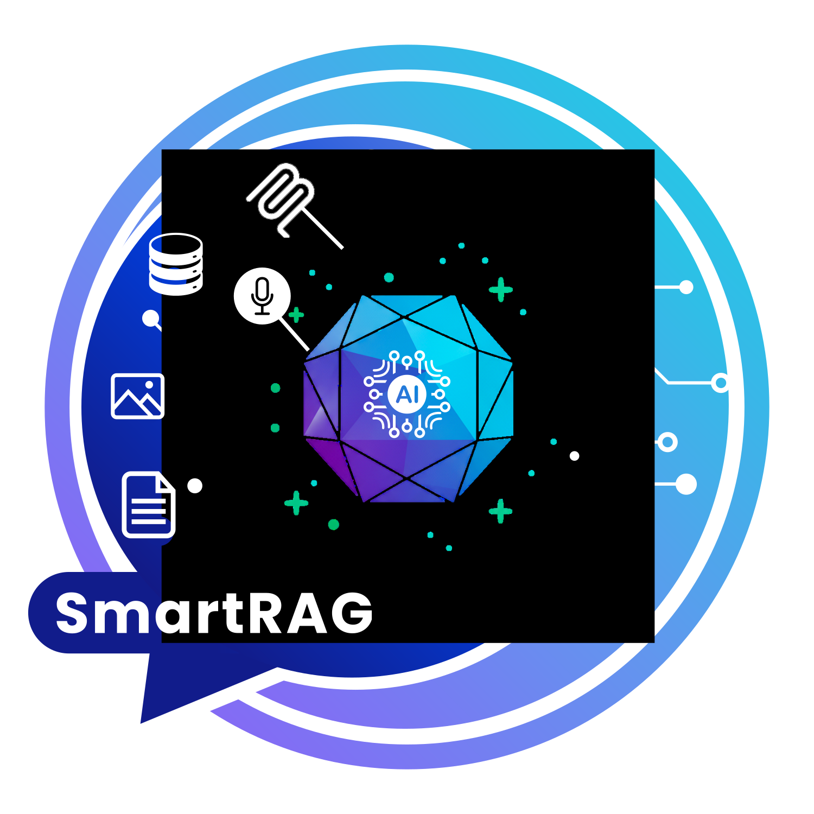
</p>

<p align="center">
  <b>.NET için Multi-Modal RAG — veritabanları, belgeler, görüntüler ve ses dosyalarını doğal dil ile sorgula</b>
</p>

<p align="center">
  <a href="https://www.nuget.org/packages/SmartRAG"></a>
  <a href="https://www.nuget.org/packages/SmartRAG"></a>
  <a href="https://github.com/byerlikaya/SmartRAG/stargazers"></a>
  <a href="LICENSE"></a>
</p>

<p align="center">
  <a href="https://github.com/byerlikaya/SmartRAG/actions"></a>
  <a href="https://www.nuget.org/packages/SmartRAG"></a>
</p>

<p align="center">
  <a href="https://byerlikaya.github.io/SmartRAG/tr/"></a>
  <a href="README.md"></a>
</p>

## 🚀 **Hızlı Başlangıç**

### **1. SmartRAG'ı Kur**
```bash
dotnet add package SmartRAG
```

### **2. Kurulum**
```csharp
// Web API uygulamaları için
builder.Services.AddSmartRag(builder.Configuration, options =>
{
    options.AIProvider = AIProvider.OpenAI;
    options.StorageProvider = StorageProvider.InMemory;
});

// Konsol uygulamaları için
var serviceProvider = services.UseSmartRag(
    configuration,
    aiProvider: AIProvider.OpenAI,
    storageProvider: StorageProvider.InMemory
);
```

### **3. Veritabanlarını appsettings.json'da yapılandır**
```json
{
  "SmartRAG": {
    "DatabaseConnections": [
      {
        "Name": "Satış",
        "ConnectionString": "Server=localhost;Database=Satis;...",
        "DatabaseType": "SqlServer"
      }
    ]
  }
}
```

### **4. Belgeleri yükle ve sorular sor**
```csharp
// Belge yükle
var belge = await documentService.UploadDocumentAsync(
    dosyaStream, dosyaAdi, icerikTipi, "kullanici-123"
);

// Veritabanları, belgeler, görüntüler ve ses dosyalarında birleşik sorgu
var cevap = await searchService.QueryIntelligenceAsync(
    "Son çeyrekte 10.000 TL üzeri alışveriş yapan tüm müşterileri, ödeme geçmişlerini ve verdikleri şikayet veya geri bildirimleri göster"
);
// → AI otomatik olarak sorgu intent'ini analiz eder ve akıllıca yönlendirir:
//   - Yüksek güven + veritabanı sorguları → Sadece veritabanlarını arar
//   - Yüksek güven + belge sorguları → Sadece belgeleri arar
//   - Orta güven → Hem veritabanlarını hem belgeleri arar, sonuçları birleştirir
// → SQL Server (siparişler), MySQL (ödemeler), PostgreSQL (müşteri verileri) sorgular
// → Yüklenen PDF sözleşmeleri, OCR ile taranmış faturaları ve transkript edilmiş çağrı kayıtlarını analiz eder
// → Tüm kaynaklardan birleşik cevap sağlar
```

### **5. (Opsiyonel) MCP Client ve Dosya İzleyici Yapılandırması**
```json
{
  "SmartRAG": {
    "Features": {
      "EnableMcpSearch": true,
      "EnableFileWatcher": true
    },
    "McpServers": [
      {
        "ServerId": "ornek-sunucu",
        "Endpoint": "https://mcp.ornek.com/api",
        "TransportType": "Http"
      }
    ],
    "WatchedFolders": [
      {
        "FolderPath": "/belgeler/yolu",
        "AllowedExtensions": [".pdf", ".docx", ".txt"],
        "AutoUpload": true
      }
    ],
    "DefaultLanguage": "tr"
  }
}
```

**SmartRAG'ı hemen test etmek ister misiniz?** → [Örnekler ve Test'e Git](#-örnekler-ve-test)

### **Dashboard (Web Arayüzü)**

SmartRAG, doküman yönetimi ve chat için yerleşik tarayıcı tabanlı bir dashboard içerir (ayrı paket gerekmez):

```csharp
builder.Services.AddSmartRag(builder.Configuration);
builder.Services.AddSmartRagDashboard(options => { options.Path = "/smartrag"; });

app.UseSmartRagDashboard("/smartrag");
app.MapSmartRagDashboard("/smartrag");
```

Ardından dokümanları listelemek, yüklemek/silmek ve aktif AI modeli ile sohbet etmek için `https://localhost:5000/smartrag` adresini açın. **Varsayılan olarak dashboard sadece Development ortamında açıktır.** Production için bu yolu kendi auth’unuzla koruyun veya `AuthorizationFilter` kullanın. Güvenlik ve seçenekler için [Dashboard dokümantasyonuna](https://byerlikaya.github.io/SmartRAG/tr/dashboard.html) bakın.

### **Dashboard ve Arayüz Genel Görünümü**

SmartRAG, dokümanları, veritabanlarını ve yapay zeka sohbetlerini yönetmek için üretime hazır bir web dashboard ile birlikte gelir.  
Aşağıdaki ekran görüntüleri, tipik bir geliştirme ortamı kurulumunu göstermektedir:

| Sohbet ve Konuşma | Veritabanı Şema Analizi |
| ----------------- | ----------------------- |
| 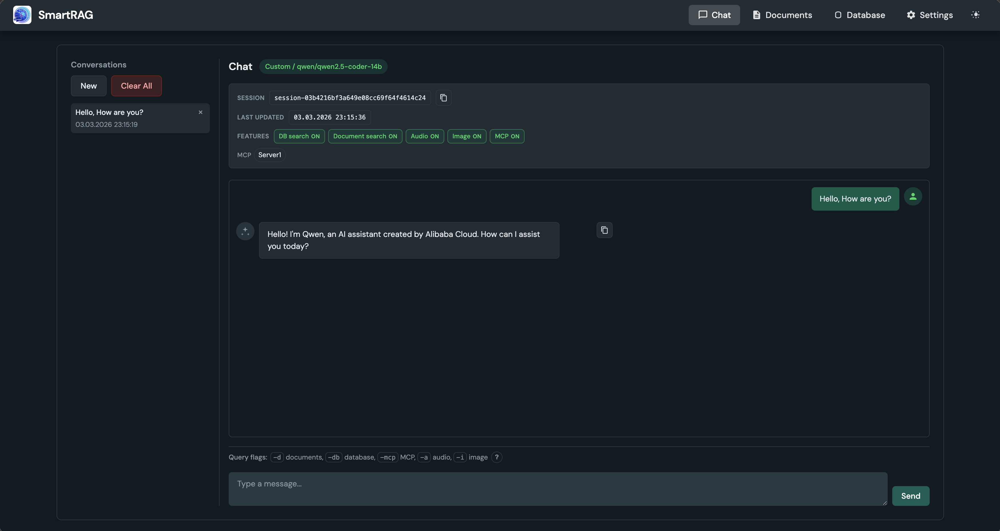 | 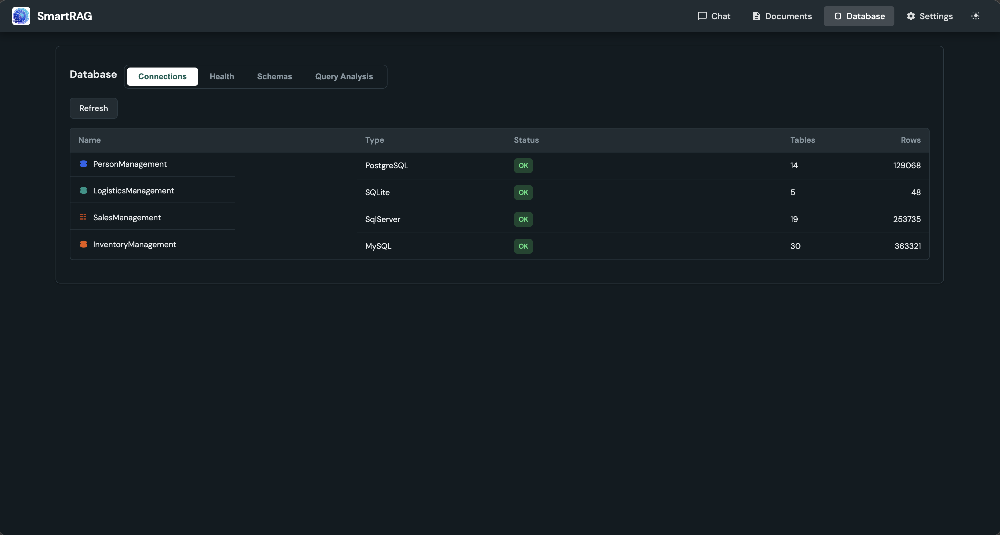 |

| Veritabanı Detayları ve İlişkiler | Doküman Yönetimi ve Ayarlar |
| --------------------------------- | --------------------------- |
| 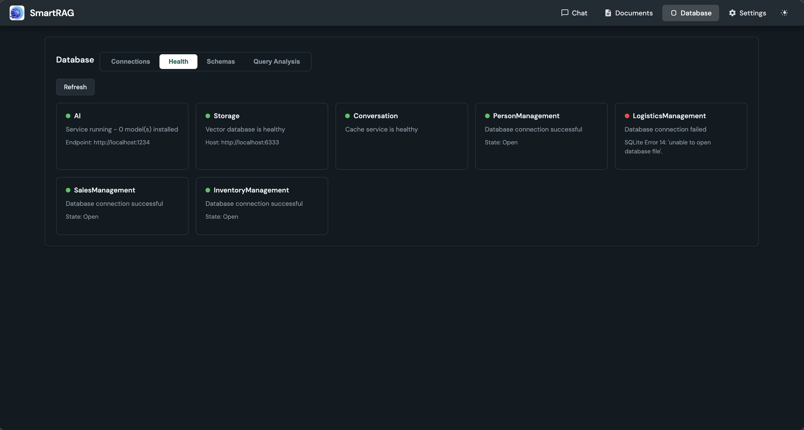 | 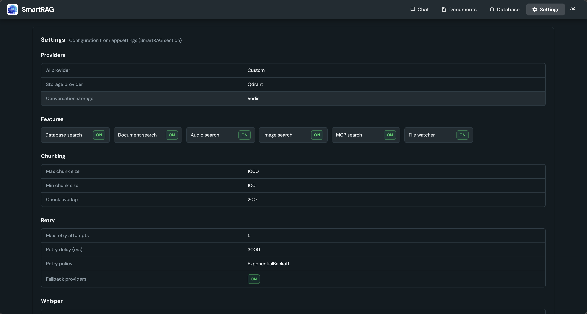 |

<details>
<summary><strong>Tüm dashboard galerisini göster (tüm ekranlar)</strong></summary>

#### Sohbet ve Konuşmalar

- 
- 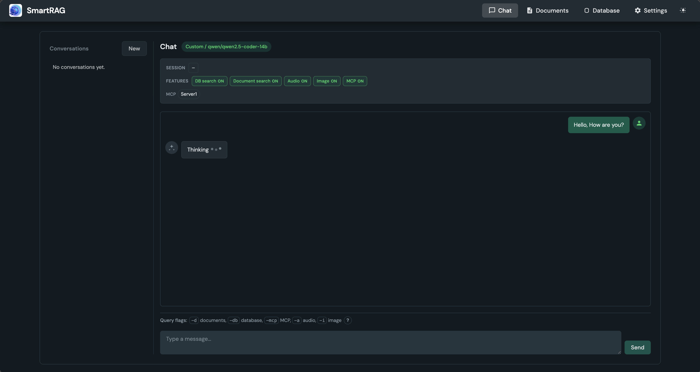
- 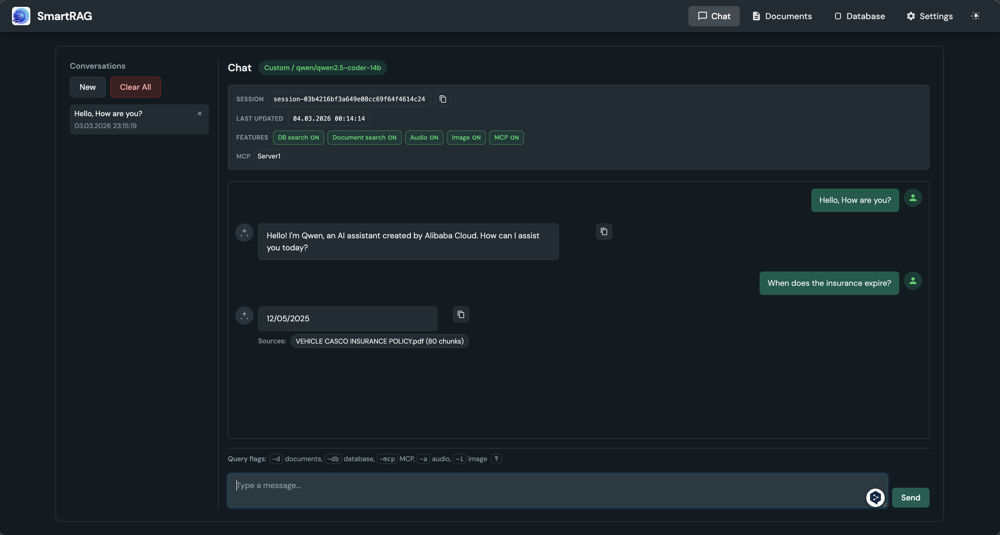

#### Veritabanı Genel Bakış ve Sağlık

- 
- 

#### Şema ve Tablo İçgörüleri

- 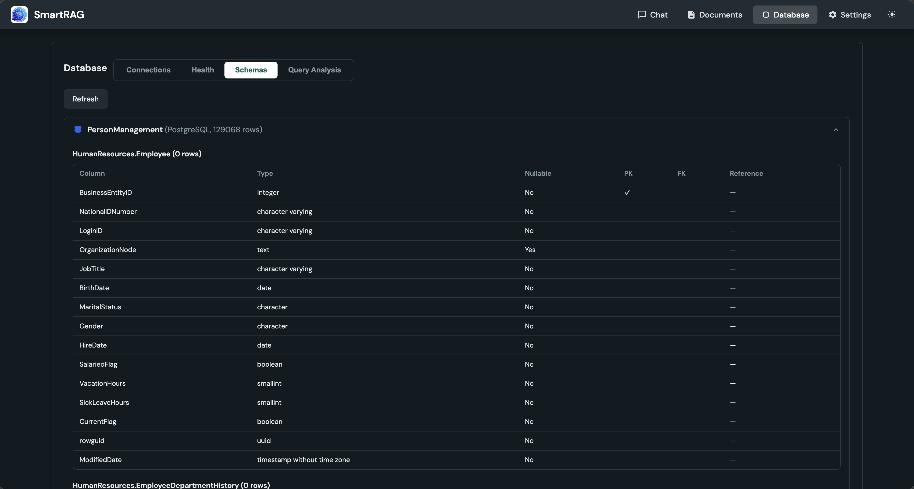
- 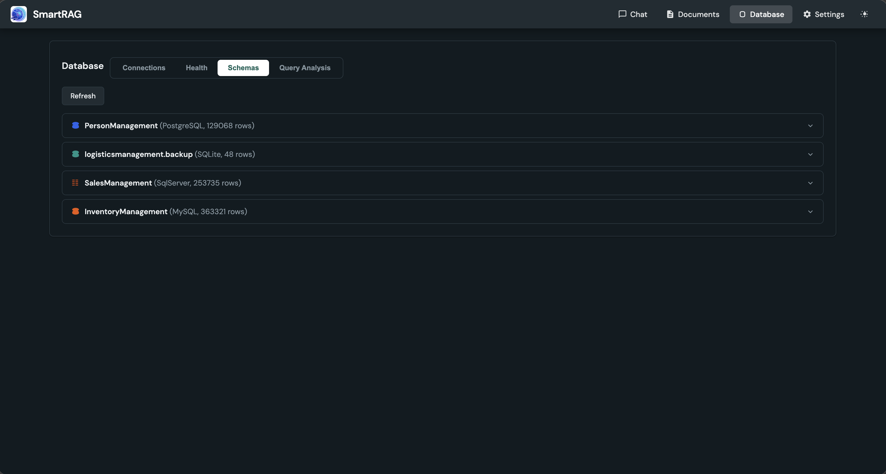
- 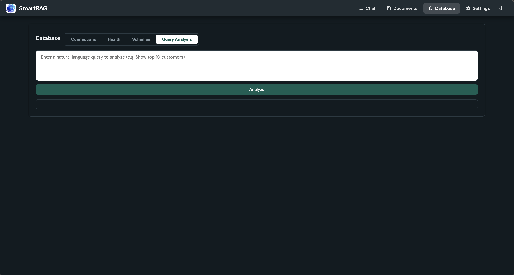
- 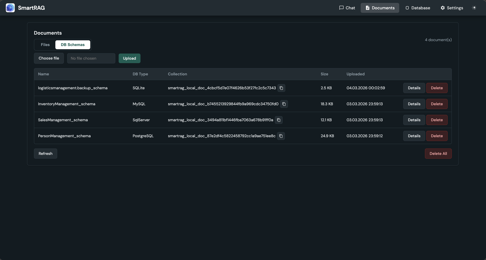
- 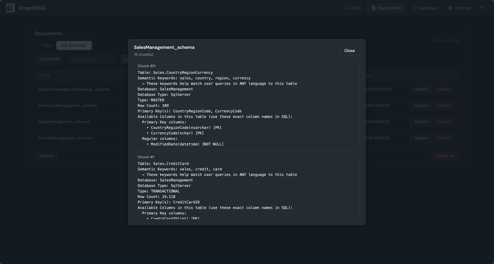

#### Dokümanlar ve Dosya İşleme

- 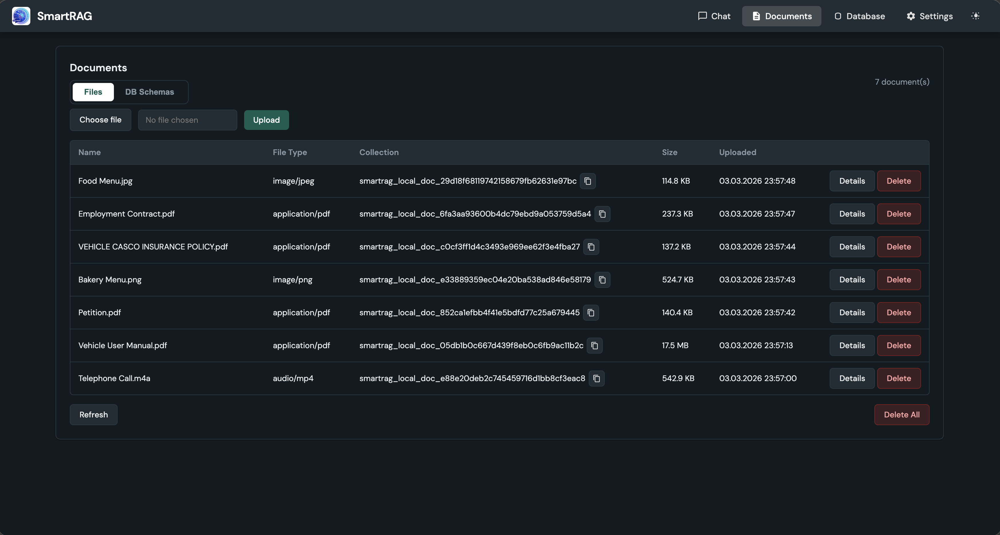

#### Ayarlar ve Konfigürasyon

- 
- 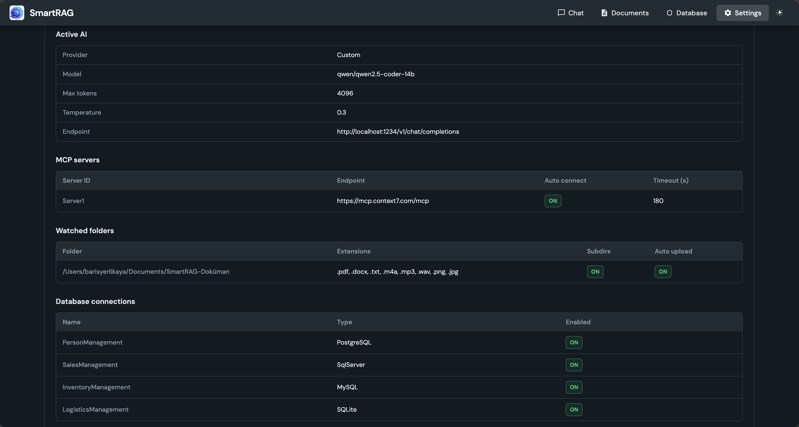

</details>

## 🏆 **Neden SmartRAG?**

🎯 **Birleşik Sorgu Zekası** - Tek sorgu ile veritabanları, belgeler, görüntüler ve ses dosyalarını otomatik olarak arar

🧠 **Akıllı Hibrit Yönlendirme** - AI sorgu intent'ini analiz eder ve optimal arama stratejisini otomatik belirler

🗄️ **Multi-Database RAG** - Birden fazla veritabanını doğal dil ile aynı anda sorgula

📄 **Çoklu Modal Zeka** - PDF, Word, Excel, Görüntü (OCR), Ses (Konuşma-Metin), ve daha fazlası  

🔌 **MCP Client Entegrasyonu** - Harici MCP sunucularına bağlan ve dış araçlarla yetenekleri genişlet

📁 **Otomatik Dosya İzleme** - Klasörleri izle ve yeni belgeleri manuel yükleme olmadan otomatik indeksle

🧩 **Modüler Mimari** - SQL diyalektleri, skorlama ve dosya ayrıştırma için Strateji Deseni

🏠 **%100 Yerel İşleme** - GDPR, KVKK, HIPAA uyumlu

🚀 **Üretim Hazır** - Kurumsal kalite, thread-safe, yüksek performans

## 🎯 **Gerçek Dünya Kullanım Senaryoları**

### **1. Bankacılık - Müşteri Finansal Profili**
```csharp
var cevap = await searchService.QueryIntelligenceAsync(
    "Hangi müşterilerin vadesi geçmiş ödemeleri var ve toplam borçları ne kadar?"
);
// → Müşteri DB, Ödeme DB, Hesap DB'yi sorgular ve sonuçları birleştirir
// → Kredi kararları için kapsamlı finansal risk değerlendirmesi sağlar
```

### **2. Sağlık - Hasta Bakım Yönetimi**
```csharp
var cevap = await searchService.QueryIntelligenceAsync(
    "Diyabet hastalarından HbA1c kontrolü 6 aydır yapılmayanları göster"
);
// → Hasta DB, Lab Sonuçları DB, Randevu DB'yi birleştirir ve risk altındaki hastaları belirler
// → Önleyici bakım uyumunu sağlar ve komplikasyonları azaltır
```

### **3. Envanter - Tedarik Zinciri Optimizasyonu**
```csharp
var cevap = await searchService.QueryIntelligenceAsync(
    "Hangi ürünlerin stoku azalıyor ve hangi tedarikçiler en hızlı yeniden stoklayabilir?"
);
// → Envanter DB, Tedarikçi DB, Sipariş Geçmişi DB'yi analiz eder ve yeniden stoklama önerileri sağlar
// → Stok tükenmesini önler ve tedarik zinciri verimliliğini optimize eder
```

## 🚀 **SmartRAG'ı Özel Kılan Nedir?**

- **Gerçek çoklu veritabanı RAG yetenekleri** .NET için
- **Otomatik şema algılama** farklı veritabanı türleri arasında  
- **%100 yerel işleme** Ollama ve Whisper.net ile
- **Kurumsal hazır** kapsamlı hata yönetimi ve loglama ile
- **Çapraz veritabanı sorguları** manuel SQL yazmadan
- **Çoklu modal zeka** belgeler, veritabanları ve AI'yı birleştirerek
- **MCP Client entegrasyonu** dış araçlarla yetenekleri genişletmek için
- **Otomatik dosya izleme** gerçek zamanlı belge indeksleme için

## 🧪 **Örnekler ve Test**

SmartRAG farklı kullanım senaryoları için kapsamlı örnek uygulamalar sağlar:

### **📁 Mevcut Örnekler**
```
examples/
├── SmartRAG.API/          # Swagger UI ile tam REST API
└── SmartRAG.Demo/         # Etkileşimli konsol uygulaması
```

### **🚀 Demo ile Hızlı Test**

SmartRAG'ı hemen görmek ister misiniz? İnteraktif konsol demo'muzu deneyin:

```bash
# Klonla ve demo'yu çalıştır
git clone https://github.com/byerlikaya/SmartRAG.git
cd SmartRAG/examples/SmartRAG.Demo
dotnet run
```

**Önkoşullar:** Yerel olarak veritabanları ve AI servisleri çalıştırmanız gerekiyor, veya kolay kurulum için Docker kullanabilirsiniz.

📖 **[SmartRAG.Demo README](examples/SmartRAG.Demo/README.tr.md)** - Tam demo uygulaması rehberi ve kurulum talimatları

#### **🐳 Docker Kurulumu (Önerilen)**

Tüm servislerin önceden yapılandırıldığı en kolay deneyim için:

```bash
# Tüm servisleri başlat (SQL Server, MySQL, PostgreSQL, Ollama, Qdrant, Redis)
docker-compose up -d

# AI modellerini kur
docker exec -it smartrag-ollama ollama pull llama3.2
docker exec -it smartrag-ollama ollama pull nomic-embed-text
```

📚 **[Tam Docker Kurulum Rehberi](examples/SmartRAG.Demo/README-Docker.tr.md)** - Detaylı Docker konfigürasyonu, sorun giderme ve yönetim

### **📋 Demo Özellikleri ve Adımları:**

**🔗 Veritabanı Yönetimi:**
- **Adım 1-2**: Bağlantıları göster ve sistem sağlık kontrolü
- **Adım 3-5**: Test veritabanları oluştur (SQL Server, MySQL, PostgreSQL)
- **Adım 6**: SQLite test veritabanı oluştur
- **Adım 7**: Veritabanı şemalarını ve ilişkileri görüntüle

**🤖 AI ve Sorgu Testleri:**
- **Adım 8**: Sorgu analizi - doğal dilin SQL'e nasıl dönüştüğünü gör
- **Adım 9**: Otomatik test sorguları - önceden hazırlanmış senaryolar
- **Adım 10**: Çoklu Veritabanı AI Sorguları - tüm veritabanlarında sorular sor

**🏠 Yerel AI Kurulumu:**
- **Adım 11**: %100 yerel işleme için Ollama modellerini kur
- **Adım 12**: Vektör depolarını test et (InMemory, FileSystem, Redis, SQLite, Qdrant)

**📄 Belge İşleme:**
- **Adım 13**: Belgeleri yükle (PDF, Word, Excel, Görüntüler, Ses)
- **Adım 14**: Yüklenen belgeleri listele ve yönet
- **Adım 15**: Temiz test için belgeleri temizle
- **Adım 16**: Konuşma Asistanı - veritabanları + belgeler + sohbet birleştir
- **Adım 17**: MCP Entegrasyonu - araçları listele ve MCP sorguları çalıştır

**📁 Dosya İzleyici:**
- Yeni belgeler için otomatik klasör izleme
- Gerçek zamanlı belge indeksleme
- Çift kayıt tespiti ve önleme

**İdeal için:** Hızlı değerlendirme, proof-of-concept, ekip demoları, SmartRAG yeteneklerini öğrenme

📚 **[Tam Örnekler ve Test Rehberi](https://byerlikaya.github.io/SmartRAG/tr/examples)** - Adım adım öğreticiler ve test senaryoları

## 🎯 **Desteklenen Veri Kaynakları**

**📊 Veritabanları:** SQL Server, MySQL, PostgreSQL, SQLite  
**📄 Belgeler:** PDF, Word, Excel, PowerPoint, Görüntü, Ses  
**🤖 AI Modelleri:** OpenAI, Anthropic, Gemini, Azure OpenAI, Ollama (yerel), LM Studio  
**🗄️ Vektör Depoları:** Qdrant, Redis, InMemory  
**💬 Konuşma Depolama:** Redis, SQLite, FileSystem, InMemory (belge depolamadan bağımsız)  
**🔌 Harici Entegrasyonlar:** MCP (Model Context Protocol) sunucuları ile genişletilmiş araç yetenekleri  
**📁 Dosya İzleme:** Gerçek zamanlı belge indeksleme ile otomatik klasör izleme

## 📄 Lisans

Bu proje MIT Lisansı altında lisanslanmıştır - detaylar için [LICENSE](LICENSE) dosyasına bakın.

**Barış Yerlikaya tarafından ❤️ ile yapıldı**

Türkiye'de yapıldı 🇹🇷 | [İletişim](mailto:b.yerlikaya@outlook.com) | [LinkedIn](https://www.linkedin.com/in/barisyerlikaya/)